# Welcome to my project for RevoU assignment. 

## In this assignment, I am creating a website that consist of HTML, CSS, and JS file. The structure is build like this : 
- Header
  - Navigation bar

- Main
  - Banner
  - Information Section
  - Product Section
  - Sign up section

- Footer
  - Company information section

**Here are the steps of creating them from scratch:**

## Building website from scratch by using HTML, CSS.

**1. Build the structure in HTML.**
> The first step is building the structure in HTML. This step important because the HTML is the core of this assignment. This is done by using VSCode to create the content of the website. The use of semantic HTML is also required.
    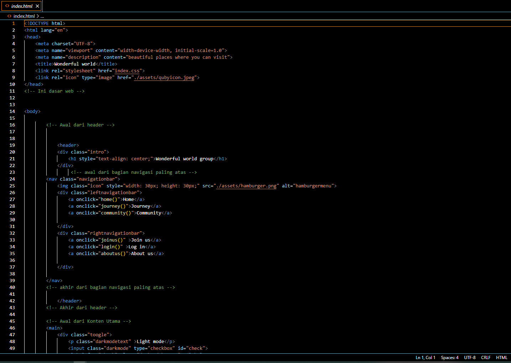

**2. Create styling in CSS.**
>    After the creation of the core is completed, it is important to use styling in the CSS so people could use the website properly. There are several things need to be applied in CSS for this assignment, such as:
>>  *. Transition and animation.
    *. The use of grid.
    *. The use of object fit on images
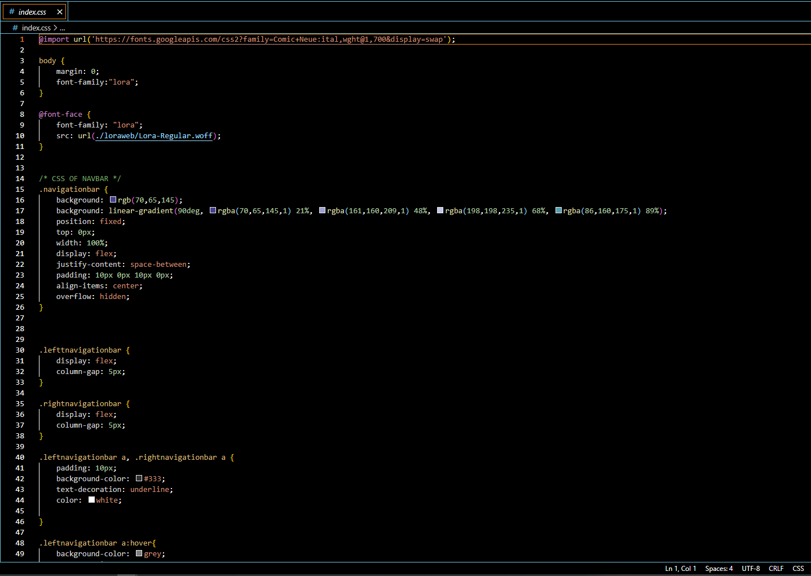

**3. Push to GitHub.**
>   After the creation of the website is done. The next step is to push the project to GITHUB as remote directory which we can access all the time.
    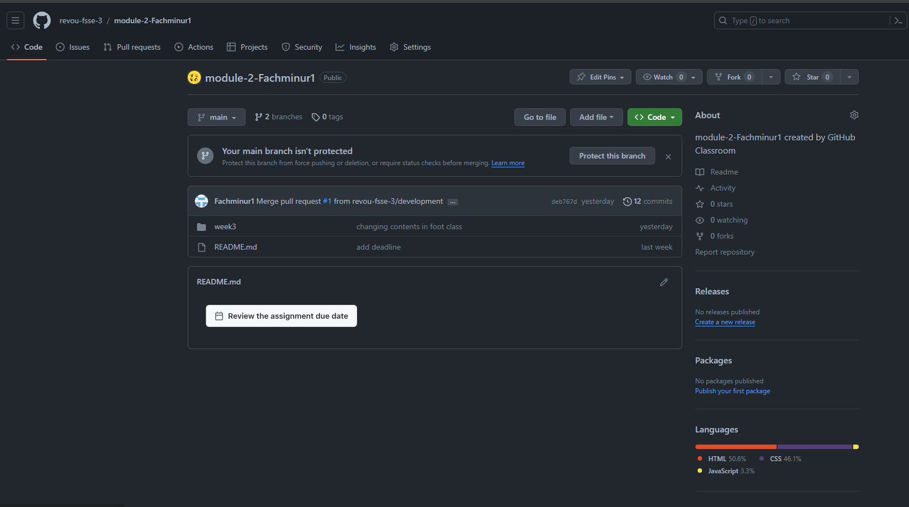

##Deployment

**1. Login to Netlify**
> After pushing your project to GitHub, login to netlify is required to deploy the project. Login with github account to automatically sync netlify account to github account.
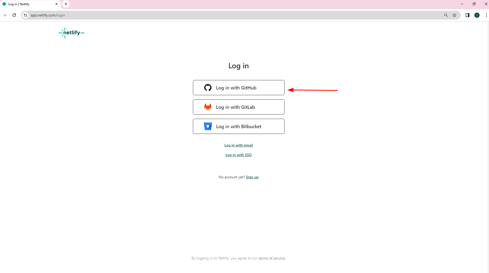

**2. Deploy the project.**
>    The next step is deploying the project from github to the web by using netlify. Here are the steps :

>>  After logging in, choose _add new site_ and choose import an existing project.
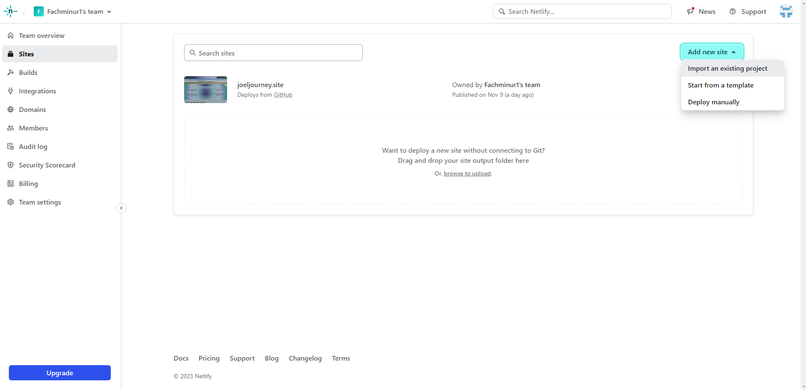
    Choose deploy from github
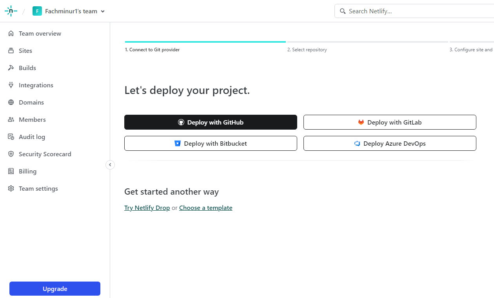
    Choose the repository for the deployment
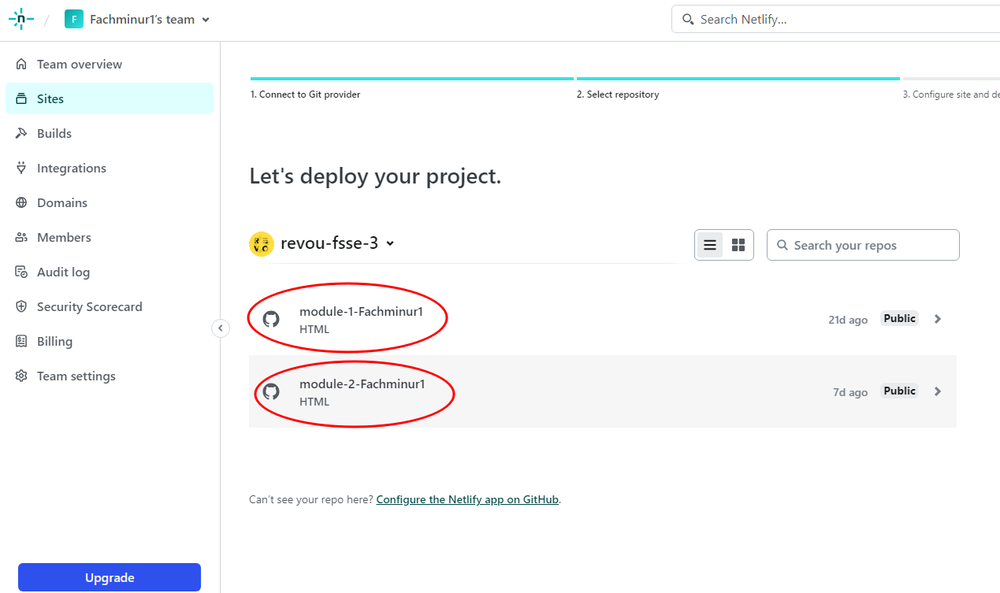
    Fill the required information and deploy the project
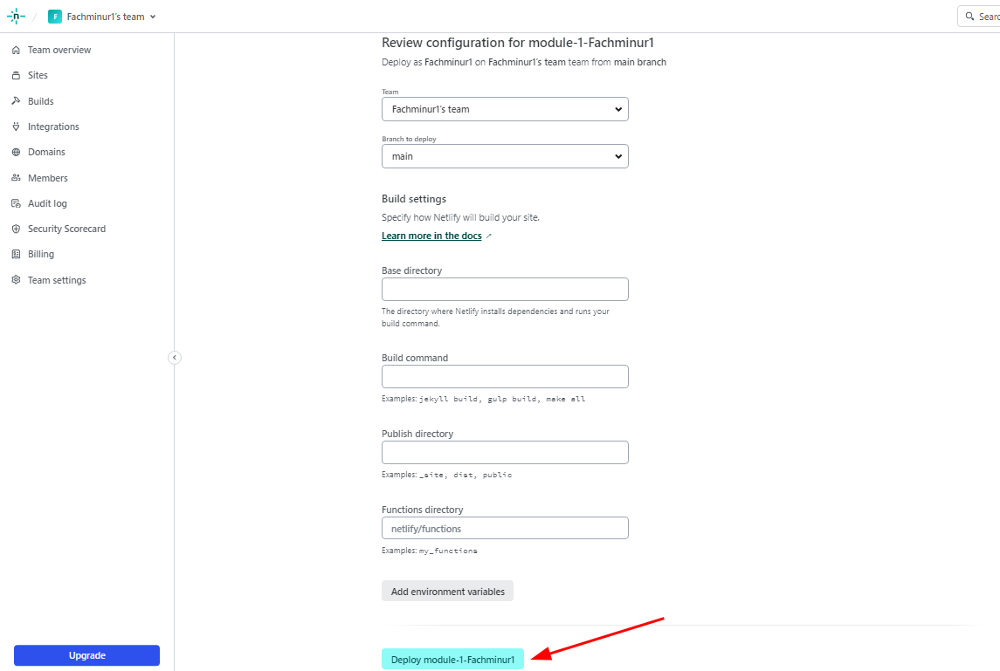
    Here is the status after deployment

**3. Use custom domain.**
>    The last step is to use custom domain purchased in Niagahoster. Setting several things such as DNS and the domain name are included in these steps.

>>  Buy the domain at Niagahoster or any other provider. Any domain can be  search and Niagahoster will automatically generates any possible domain name.
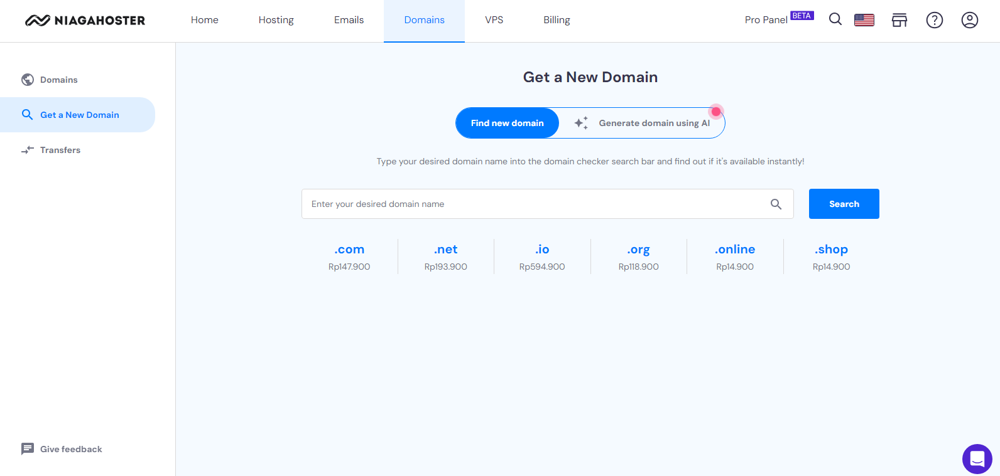
    After purchasing the domain. Setting the DNS is required in order to make the custom domain work. Go back to Netlify and choose Domain Management at the project overview.

    Choose add domain alias
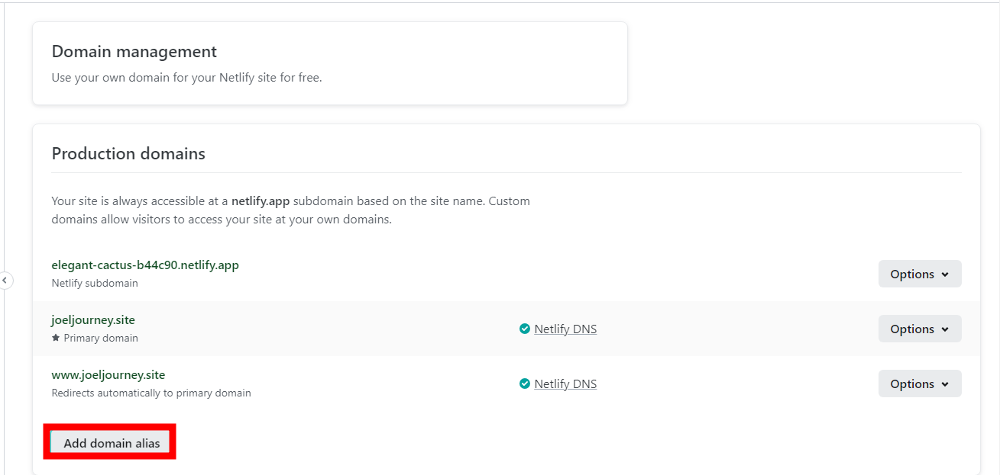
    After adding custom domain, DNS need to be set. Go to options and go to DNS Panel
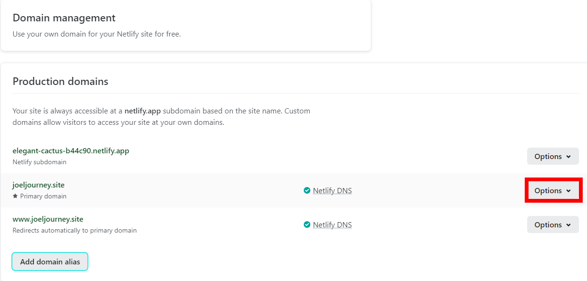
    The content in the selected area is the DNS that needs to be set in Niagahoster. 
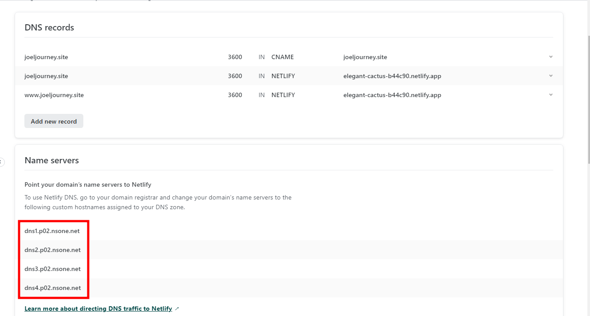
    Go back to Niagahoster and change the DNS shown on Netlify.
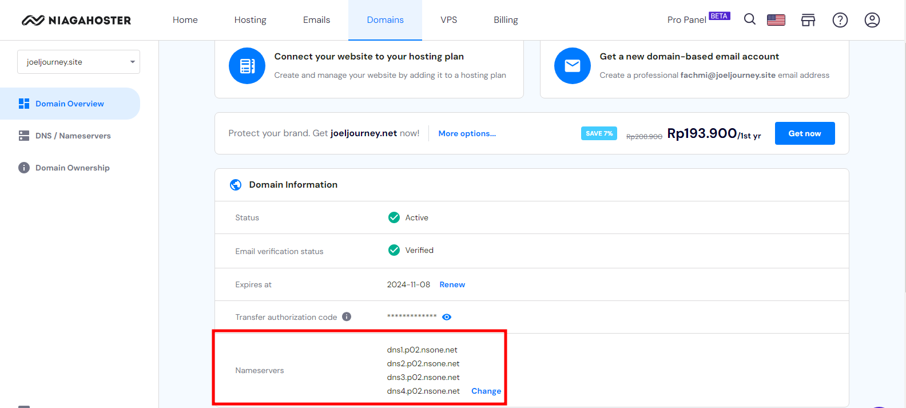
    Go check the domain management after setting the DNS. It might take a while for the DNS to be set up. Once it is checked. Then the site is ready to deploy with the custom domain
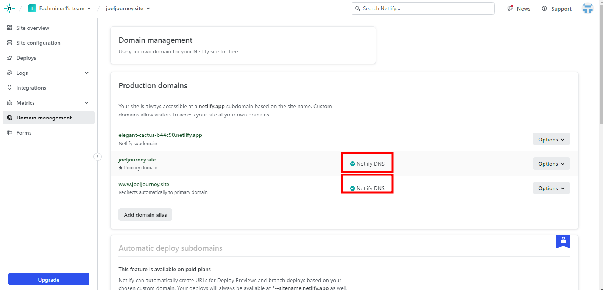
    You can also set the DNS in Cloudflare. visit cloudflare.com then sign up if you dont have an account.
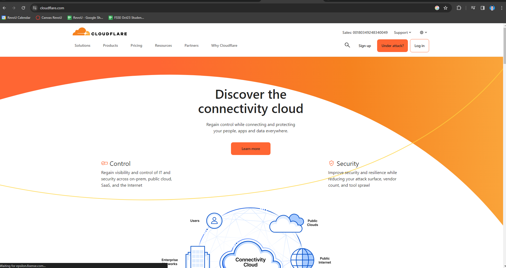
    After loging in. The website will ask for the website to be set. List of your website will be availabe here
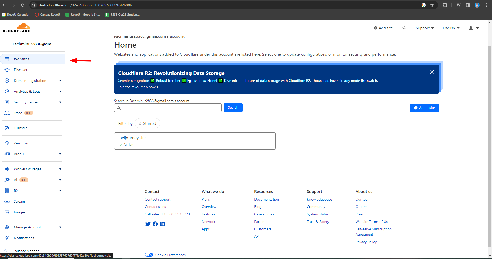
    After selecting the website. Choose the option DNS to set your DNS. Then go back to the hosting website to change the DNS
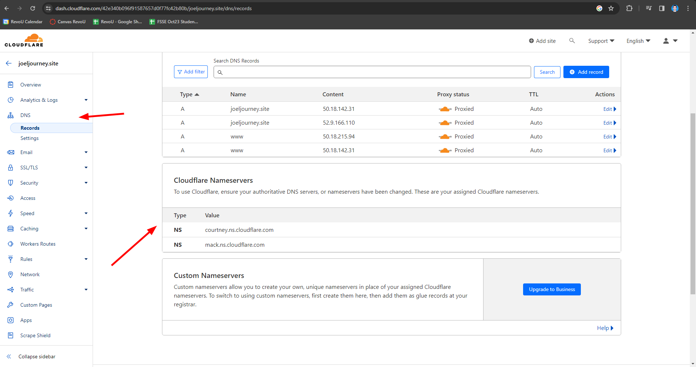

    My project's domain name is http://joeljourney.site/